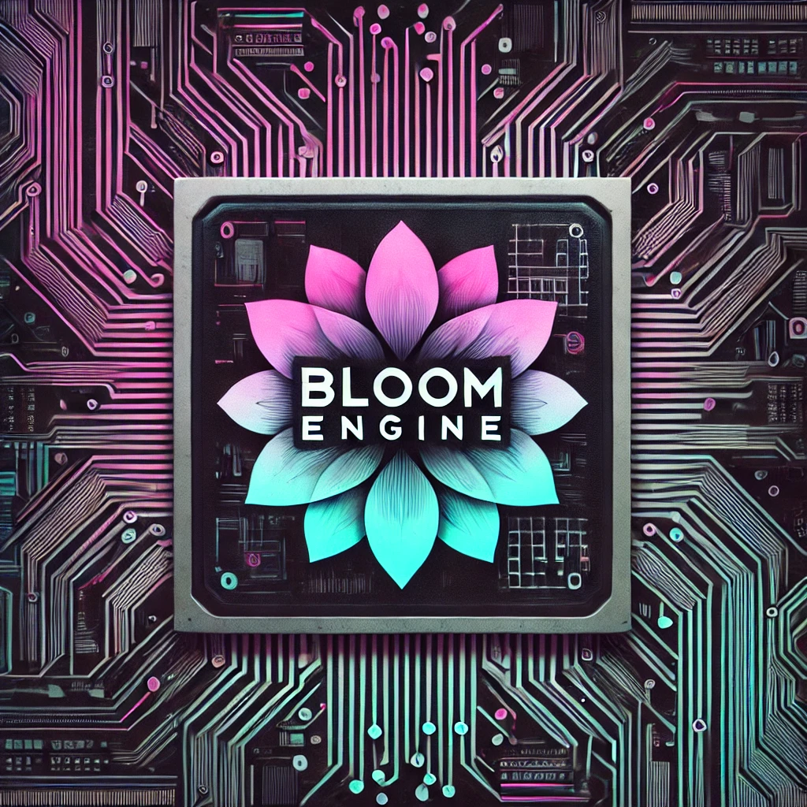
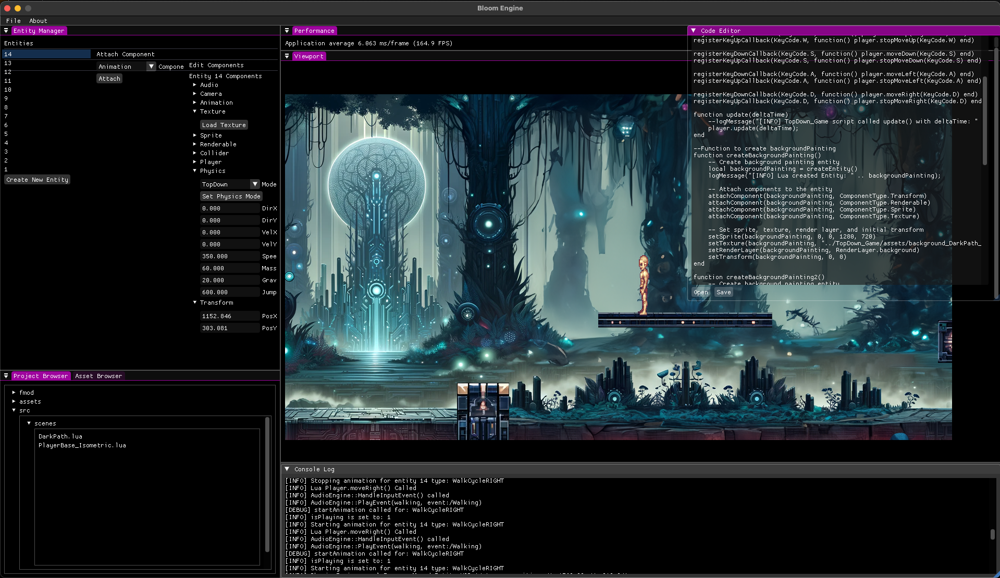

# Bloom Engine
## Bloom Engine is a 2D game engine built in C++ utilizing SDL2, Dear ImGui, FMOD, and Lua.
Bloom Engine is an early-stage game engine built with an Entity-Component-System (ECS) architecture, using an event dispatcher to facilitate communication between engine systems. It leverages SDL2 for graphics rendering and hardware access, Dear ImGui for the editor interface, and FMOD for audio processing. Lua is integrated for scripting level design and gameplay logic.

Bloom Engine currently supports two physics modes enabling the development of top-down and side-scrolling games. A point-and-click movement system is planned for a future update to support isometric games. 

As a personal passion project, this engine helps me deepen my knowledge of C++ and game programming. While updates may be sporadic, I’m excited to continue enhancing and expanding its capabilities.

## Bloom Engine Editor
Below is a screenshot of the Bloom Engine editor with an example side-scrolling game project loaded. On the left, you can create and select entities, and for each selected entity, you can attach and modify components. The project file browser is located in the bottom left corner. The top middle section displays performance metrics, including average FPS. The central viewport provides a live view of the game. Beneath the viewport is a real-time debug console, which shows system calls and debug messages. In the top right corner, a simple text editor is available for loading and editing Lua scripts used for level design and gameplay mechanics.
